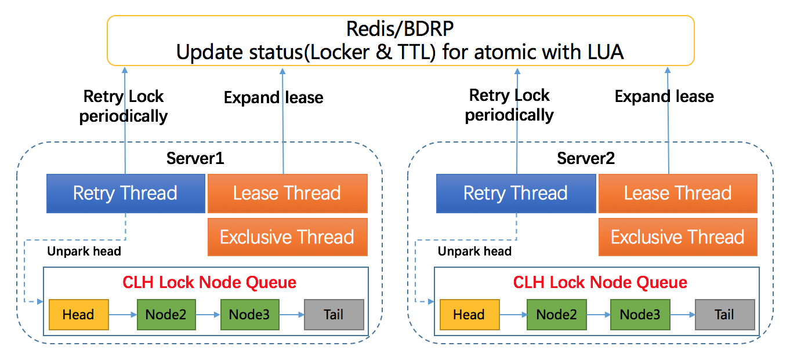
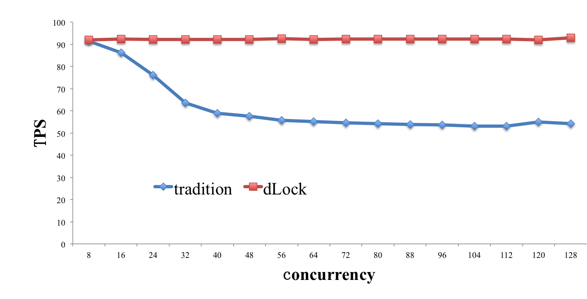

DLock - Distributed Lock
==========================
[In Chinese 中文版](README.zh_cn.md)

DLock is a Java implemented, effective and reliable Distributed Lock. It uses Redis to store lock object,
and executes atomic operation on lock via [Lua](https://en.wikipedia.org/wiki/Lua_(programming_language&#41;) script.
Based on Redis expire mechanism, DLock implements lock [lease](https://en.wikipedia.org/wiki/Lease_(computer_science&#41;)
to ensure release. In order to provide high performance, DLock adopts process level lock model and uses
variant CLH queue to manage lock competitors.

Requirements：[Java8](http://www.oracle.com/technetwork/java/javase/downloads/jdk8-downloads-2133151.html)+、
[Redis2.6.12](https://redis.io/download)+（Require Redis Set -> NX PX command）

Architecture
--------


#### Features ####
* Atomic lock operation

  One Lock Operation will correspond to one Lua script. Since Redis can execute Lua script atomically,
  Lock Operation such as lock, release and expand lease will be atomic.

* Reentrant ability

  The variable ```holdCount ```is maintained by local DLock object. ```holdCount``` will be increased by one when
  locker re-enter, and decreased by one when leave.

* Lock lease

  On the basis of Redis expire mechanism, the lock lease is integrated to release lock after the locker
  crashed. That is to say, infinite lock hold will never happen.

* High performance lock model

  A lock-free variant CLH queue is used to maintain the competitor threads. And the retry thread will periodically
  awake the CLH queue's head thread to retry, so that only one thread per process can participate in lock competition,
  which will avoid unnecessary lock competition. Meanwhile, the unfair lock is also provided for throughput.


Quick Start
------------
Here we have a demo with 3 steps to introduce how to integrate DLock into Spring based projects.<br/>

### Step 1: Install Java8, Maven, Redis
If you have already installed Maven, JDK and Redis, just skip to next.<br/>
Download [Java8](http://www.oracle.com/technetwork/java/javase/downloads/jdk8-downloads-2133151.html),
[Maven](https://maven.apache.org/download.cgi) and [Redis2.6.12](https://redis.io/download), then install. For maven,
extracting and setting MAVEN_HOME is enough.
Download, extract and compile Redis with:
```sh
wget http://download.redis.io/releases/redis-3.2.6.tar.gz
tar xzf redis-3.2.6.tar.gz
cd redis-3.2.6
make
```
The binaries that are now compiled are available in the src directory. Run Redis with:
```sh
src/redis-server
```
Now, Redis server is ready to accept connections on port 6379 by default.

#### Set JAVA_HOME & MAVEN_HOME
Here is a sample script to set JAVA_HOME and MAVEN_HOME
```shell
export MAVEN_HOME=/xxx/xxx/software/maven/apache-maven-3.3.9
export PATH=$MAVEN_HOME/bin:$PATH
JAVA_HOME="/Library/Java/JavaVirtualMachines/jdk1.8.0_91.jdk/Contents/Home";
export JAVA_HOME;
```

### Step 2: Reset Redis configuration
Reset property of 'redis.host' and 'redis.port' in [redis.properties](src/test/resources/dlock/redis.properties)


### Step 3: Run UnitTest
DLock implements the interface of `java.util.concurrent.Lock`, and so, you can use DLock like that.<br/>
[DLockSimpleTest](src/test/java/com/baidu/fsg/dlock/DLockSimpleTest.java) shows basic use of DLock;<br/>
[DistributedReentrantLockTest](src/test/java/com/baidu/fsg/dlock/DistributedReentrantLockTest.java) show more complex use such like multi-competitors, reentrant lock.

DLock TPS
-------------
DLock will group lock competitors into several groups, only one competitor of a group is able to compete, and
competitors within a group obtain the competition chance sequentially by default. This will avoid unnecessary
competition. To verify that, we compare DLock with tradition Lock Model(```tradition```) using the concept 'Lock Trip',
and a 'Lock Trip' consists of ```lock()```, ```calculate()```, and ```unlock()```.
In experiment, we set ```calculate()``` time and DLock's lease time to 10ms and 60ms separately, and vary concurrency
from 8 to 128 with step 8. Finally, the TPS ratio of DLock to ```tradition``` is calculated, i.e:<br/>
R = TPS<sub>DLock</sub> / TPS<sub>tradition</sub><br/>

|threads|8|16|24|32|40|48|56|64|72|80|88|96|104|112|120|128
|:---:|:---:|:---:|:---:|:---:|:---:|:---:|:---:|:---:|:---:|:---:|:---:|:---:|:---:|:---:|:---:|:---:|
|R|1.01 |1.07 |1.21 |1.45 |1.56 |1.60 |1.66 |1.67 |1.69 |1.70 |1.71 |1.72 |1.74 |1.74 |1.67 |1.71 |

####Attention
The Lock Model's TPS is related to ```calculate()```, so we just consider the performance trend.<br/>


However, R value has nothing to with ```calculate()``` time, and so it is significant.<br/>


From above data, we find ```tradition``` has comparable performance to DLock in low concurrency environment.
With the increase of concurrency, ```tradition```'s performance degrade rapidly. But DLock is still good, this is
because DLock will group competitors into a few groups with only one active competitor per group, as a result, DLock's
performance will not worsen with concurrency increase. Furthermore, DLock implements non-fair Lock, which can respond
to high priority request.